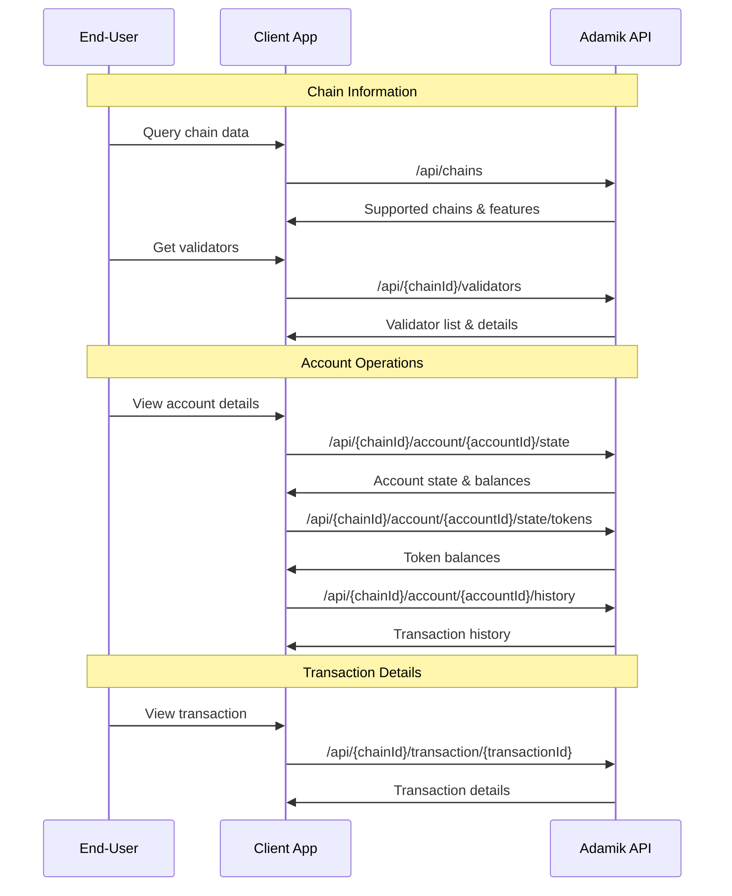

The **Read API** provides endpoints to retrieve blockchain data across multiple categories. These endpoints deliver standardized responses across all supported networks.

## API Categories

### Chain Information

- **Get Supported Chains** (`GET /api/chains`): List all supported blockchain networks and their features
- **Get Chain Info** (`GET /api/chain/{chainId}`): Detailed information about a specific blockchain
- **Get Validators** (`GET /api/{chainId}/validators`): List of validators and their details
- **Get Transaction Details** (`GET /api/{chainId}/transaction/{transactionId}`): Detailed transaction information

### Account Operations

- **Get Account State** (`GET /api/{chainId}/account/{accountId}/state`): Comprehensive account information including balances
- **Get Account Tokens** (`GET /api/{chainId}/account/{accountId}/state/tokens`): List of tokens owned by an account
- **Get Account History** (`GET /api/{chainId}/account/{accountId}/history`): Transaction history for an account

### Utilities

- **Encode Address** (`POST /api/{chainId}/address/encode`): Convert public key to chain-specific address format
- **Validate Address** (`POST /api/{chainId}/address/validate`): Verify address format for a specific chain

## Interaction Flow



<Info>
  **Note**: All Read API endpoints are stateless and return standardized
  responses across different blockchain networks. Pagination is supported where
  applicable using the `nextPage` parameter.
</Info>

## Chain-Specific Features

The Read API adapts to each blockchain's capabilities:

```json
{
  "read": {
    "token": true, // Token information support
    "validators": true, // Validator queries support
    "transaction": {
      "native": true, // Native transaction queries
      "tokens": true, // Token transaction queries
      "staking": true // Staking transaction queries
    },
    "account": {
      "balances": {
        "native": true, // Native balance queries
        "tokens": true, // Token balance queries
        "staking": true // Staking position queries
      },
      "transactions": {
        "native": true, // Native transaction history
        "tokens": true, // Token transaction history
        "staking": true // Staking transaction history
      }
    }
  }
}
```

## Response Standardization

The API provides consistent response formats across all chains:

- Transaction states are normalized (`pending`, `unconfirmed`, `confirmed`, `failed`, `unknown`)
- Transaction types are standardized (`transfer`, `transferToken`, `delegate`, `redelegate`, `undelegate`, `claimRewards`)
- Optional `include` parameters allow requesting additional data (e.g., `parsed` and `raw` transaction details)

For implementation details, refer to:

- [Get Chain Details](../api-reference/current/chain/get-chain-details)
- [Get Account State](../api-reference/current/account/get-account-state)
- [Get Transaction Details](../api-reference/current/chain/get-transaction-details)
