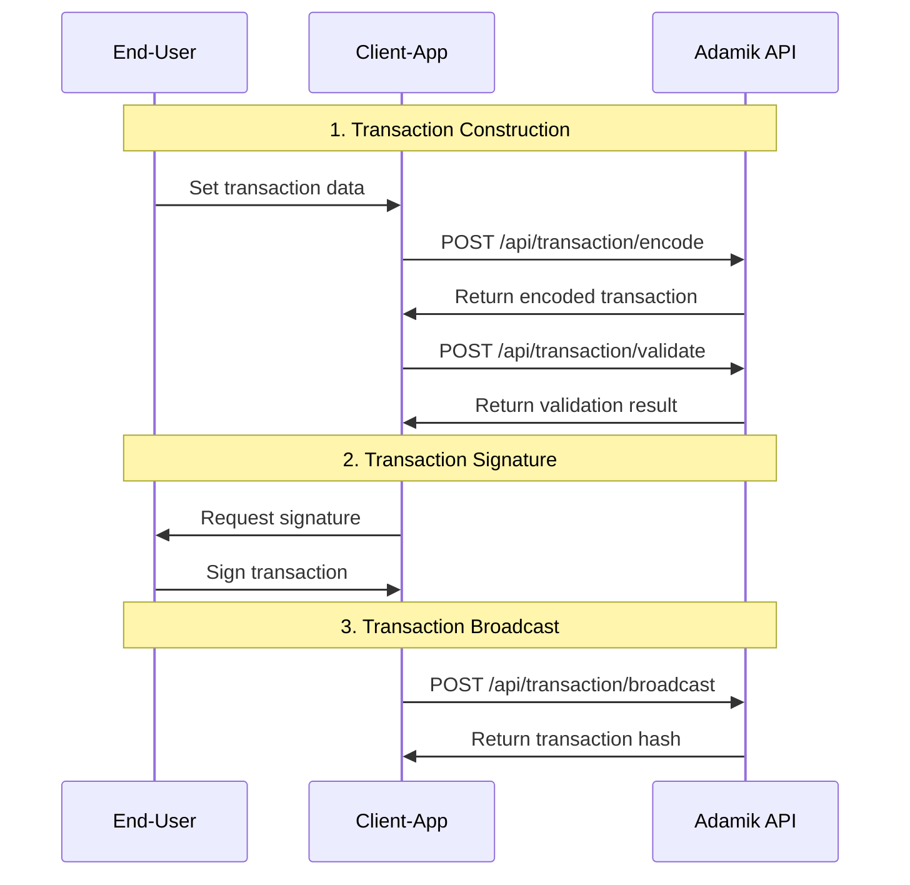

The Write API provides endpoints for managing blockchain transactions. These endpoints handle transaction encoding, validation, and broadcasting across all supported networks.

## Transaction Lifecycle

### 1. Transaction Encoding

The `/api/transaction/encode` endpoint streamlines transaction creation by:

- Validating input parameters
- Calculating fees and gas estimates
- Applying chain-specific rules
- Preparing the transaction for signing

### 2. Transaction Validation

The validation endpoint helps verify transactions before broadcasting:

- Checks transaction structure
- Validates sender's balance
- Verifies chain-specific requirements

### 3. Transaction Broadcasting

Two options for broadcasting transactions:

- **Standard Broadcast** (`POST /api/transaction/broadcast`): For regular signed transactions
- **Raw Broadcast** (`POST /api/transaction/broadcast/raw`): For pre-formatted transaction payloads



## Supported Transaction Types

The API supports various transaction types across chains:

- **Native Transfers**: Send native blockchain currency
- **Token Transfers**: Handle ERC20 and other token standards
- **Staking Operations**: Delegate, redelegate, undelegate, and claim rewards

<Info>
  Each chain may support different transaction types. Use the `/api/chains`
  endpoint to check supported features for any chains.
</Info>

## Chain-Specific Features

The Write API adapts to each blockchain's capabilities:

```json
{
  "write": {
    "transaction": {
      "type": {
        "native": true, // Native currency transfers
        "tokens": true, // Token operations
        "staking": true // Staking operations
      },
      "field": {
        "memo": true // Optional transaction memo support
      }
    }
  }
}
```

## Error Handling

The API provides detailed error feedback:

- Pre-broadcast validation errors
- Chain-specific rejection reasons
- Broadcasting status and confirmation details

For implementation details, refer to:

- [Encode a Transaction](../api-reference/current/transaction/encode-a-transaction)
- [Validate Transaction](../api-reference/current/transaction/validate-transaction)
- [Broadcast Transaction](../api-reference/current/transaction/broadcast-transaction)
