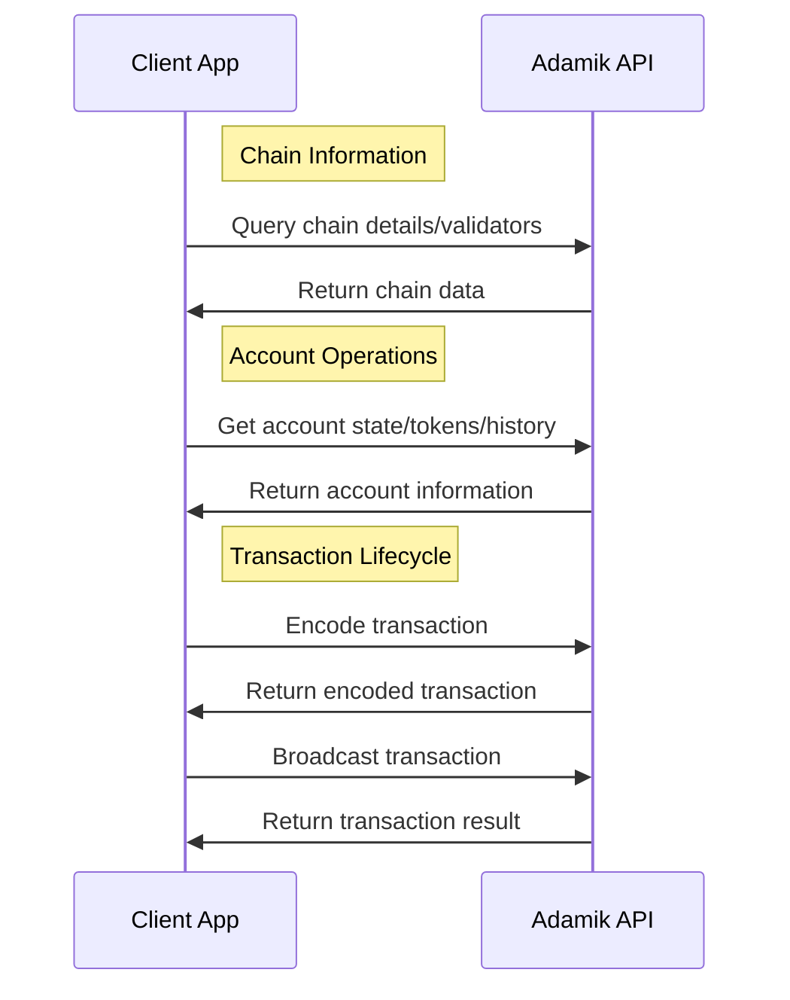

Before exploring the detailed specifications and API references, review these high-level principles for an overview of the API's capabilities and workflow.

## API Categories

The Adamik API is organized into four main categories:

- **Chain**: Query blockchain network information and validators
- **Account**: Retrieve account states, balances, and history
- **Transaction**: Manage transaction lifecycle from encoding to broadcasting
- **Utils**: Handle utility operations and helper functions

<CardGroup cols={3}>
  <Card
    title="Chain & Account APIs"
    icon="magnifying-glass"
    href="../api-reference/current/chain/get-supported-chains"
  >
    Read operations: Query network information and account states
  </Card>
  <Card
    title="Transaction APIs"
    icon="pen-to-square"
    href="../api-reference/current/transaction/encode-a-transaction"
  >
    Write operations: Manage transaction lifecycle
  </Card>
  <Card
    title="Utils APIs"
    icon="wrench"
    href="../api-reference/current/utils/encode-an-address"
  >
    Utility functions and helper operations
  </Card>
</CardGroup>

<Info>
  Note that our APIs are fully stateless and do not require access to private
  keys.
</Info>
